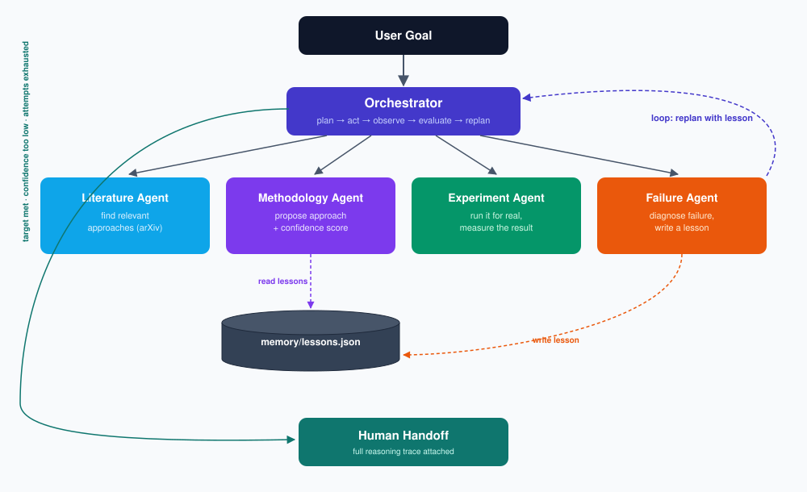

<div align="center">

# ⚡ ReflexAgent

### A Multilingual Voice AI Mentor That Learns From Its Own Failures

**Team Astra** · Build for Billions · Agentic AI for Billions track


</div>

---

ReflexAgent is a small team of AI agents that plans an approach to a goal, runs a real experiment, checks the result against a target, learns from any failure, and tries again — with every step visible. This repo contains the working core loop plus a fully wired agriculture demo (crop-disease-style classification).

## Table of Contents

- [How it works](#how-it-works)
- [Key features](#-key-features)
- [Project layout](#-project-layout)
- [Setup](#-setup)
- [Run the CLI demo](#️-run-the-cli-demo-agriculture-example)
- [Run the dashboard](#-run-the-dashboard)
- [Voice input](#-voice-input-optional)
- [Adding a new use case](#-adding-a-new-use-case)
- [Status](#-status)
- [References](#-references)

## How it works

<p align="center">
  
</p>

<details>
<summary>Text version</summary>

```
User goal ──▶ Orchestrator ──▶ Literature Agent   (find relevant approaches)
                    │        └▶ Methodology Agent  (propose approach + confidence)
                    │        └▶ Experiment Agent   (run it for real, measure result)
                    │        └▶ Failure Agent      (diagnose + write a lesson)
                    └── loop until target met, confidence too low, or attempts run out
                              → then hand off to a human with full reasoning
```

</details>

Every attempt is logged. Lessons from failed attempts are written to `memory/lessons.json` and retrieved by the Methodology Agent on the next attempt, so the system visibly gets smarter run over run.

## ✨ Key Features

- **Self-correcting loop** : plan → act → observe → evaluate → replan, not a single-shot answer
- **Persistent lessons** : every failure is diagnosed and written back to memory, so the next attempt starts smarter
- **Full transparency** : the literature search, proposed methodology, confidence score, experiment result, and any diagnosis are all logged and shown in the dashboard
- **Works with no network or API key** : an offline mock-LLM mode keeps the loop running for demos on stage
- **Multilingual voice input (optional)** : STT/TTS wrappers with automatic fallback to typed text
- **Domain-agnostic** : point the same loop at a new use case by adding one config entry, no code changes

## 📁 Project Layout

```
reflexagent/
├── config.py                  # thresholds, model names, env loading
├── orchestrator.py            # plan → act → observe → evaluate → replan loop
├── llm/client.py               # Groq primary, Gemini fallback, offline mock mode
├── memory/memory_store.py      # JSON-backed lesson store (Chroma-ready)
├── agents/
│   ├── literature_agent.py    # arXiv search + cached fallback
│   ├── methodology_agent.py   # retrieves lessons, proposes approach + confidence
│   ├── experiment_agent.py    # runs a real scikit-learn experiment
│   └── failure_agent.py       # diagnoses failure, writes structured lesson
├── voice/speech.py             # STT/TTS wrappers (optional, degrade to text)
├── data/cached_papers.json     # offline fallback for the Literature Agent
├── dashboard/app.py            # Streamlit UI: agent trace + baseline comparison
├── demo/run_agriculture_demo.py
└── tests/test_smoke.py
```

## 🚀 Setup

```bash
cd reflexagent
python -m venv .venv && source .venv/bin/activate     # optional but recommended
pip install -r requirements.txt
cp .env.example .env
# Add GROQ_API_KEY and/or GOOGLE_API_KEY to .env if you have them.
# Without any key, the system runs in offline mock-LLM mode automatically —
# useful for demos on stage with no network.
```

## ▶️ Run the CLI demo (agriculture example)

```bash
python demo/run_agriculture_demo.py
```

This runs the full loop end to end: literature lookup → methodology proposal → real experiment → evaluation → (on failure) diagnosis + lesson → replan, up to the attempt limit in `config.py`, and prints a full trace plus a comparison against a single-shot "plain AI" baseline.

## 📊 Run the dashboard

```bash
streamlit run dashboard/app.py
```

Shows, side by side: the plain single-shot baseline vs. ReflexAgent's iterative accuracy curve, the lesson retrieved at each step, and confidence per attempt.

## 🎙️ Voice input (optional)

`voice/speech.py` wraps Whisper-on-Groq / the browser Web Speech API for STT and gTTS / browser speech synthesis for TTS. If neither is installed or no network is available, the orchestrator automatically falls back to typed text — the core loop never depends on voice being present.

## 🧩 Adding a new use case

The loop is domain-agnostic. To point it at a new use case (healthcare screening, education, financial inclusion, ...), add a new entry to `config.DOMAIN_TASKS` with:

- `goal`: natural-language description of the task
- `dataset_loader`: a callable returning `(X, y)`
- `target_metric` and `target_value`

No other file needs to change : see `demo/run_agriculture_demo.py` for the pattern used for agriculture.

## 📌 Status

Tested on free accounts: Groq API, Gemini API, arXiv API, scikit-learn, Streamlit. Voice (STT/TTS) is wired but marked as a planned addition — the loop runs fully on text if voice libraries are absent.

## 📚 References

- Shinn et al., *Reflexion: Language Agents with Verbal Reinforcement Learning* (NeurIPS 2023) — [arXiv:2303.11366](https://arxiv.org/abs/2303.11366)
- Yao et al., *ReAct: Synergizing Reasoning and Acting in Language Models* (2022) — [arXiv:2210.03629](https://arxiv.org/abs/2210.03629)
- Madaan et al., *Self-Refine: Iterative Refinement with Self-Feedback* (NeurIPS 2023) — [arXiv:2303.17651](https://arxiv.org/abs/2303.17651)

---

<div align="center">
<sub>Built by <b>Team Astra</b> for Build for Billions — Agentic AI for Billions track</sub>
</div>
